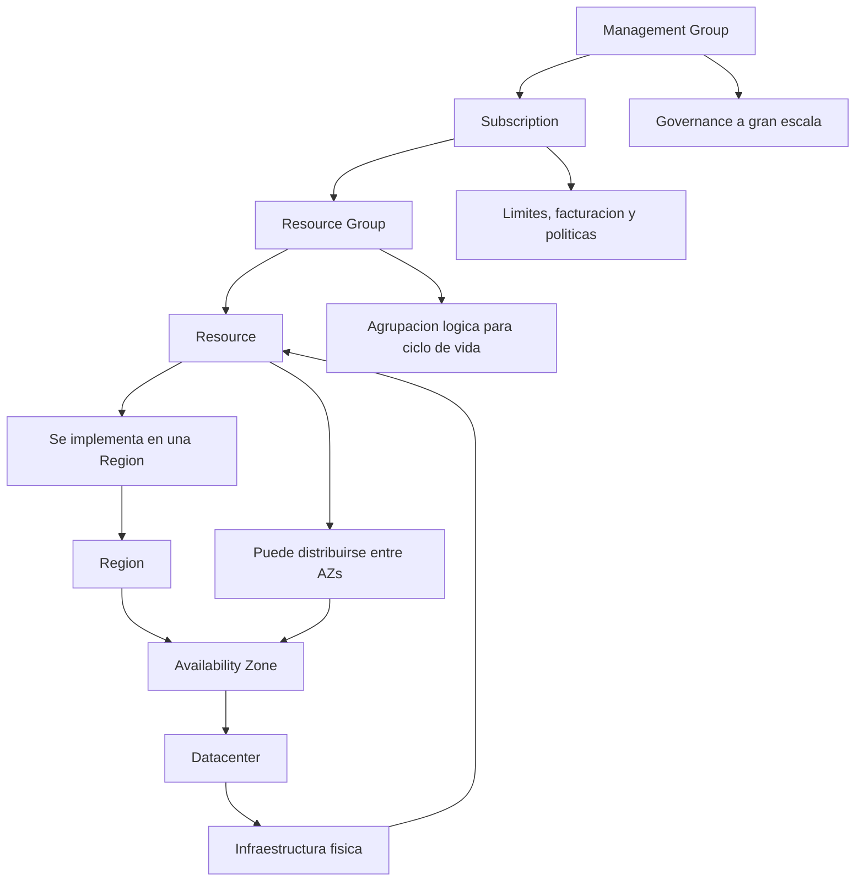

# Mapa conceptual de la jerarquia y la infraestructura en Azure

Este mapa conecta la **jerarquia administrativa** (Management Groups -> Subscriptions -> Resource Groups -> Resources) con la **infraestructura fisica/logica** (Regions -> Availability Zones -> Datacenters).

## Relacion clave

1. **Management Groups** organizan multiples subscriptions para aplicar gobernanza.
2. Cada **Subscription** contiene uno o varios **Resource Groups**.
3. Cada **Resource Group** contiene **Resources** (VMs, Storage, SQL, etc.).
4. Todo **Resource** se despliega en una **Region**.
5. Una **Region** tiene una o mas **Availability Zones**.
6. Cada **Availability Zone** esta formada por uno o mas **Datacenters** fisicamente separados.
7. Distribuir recursos entre zonas aumenta la **alta disponibilidad** y la **resiliencia**.
